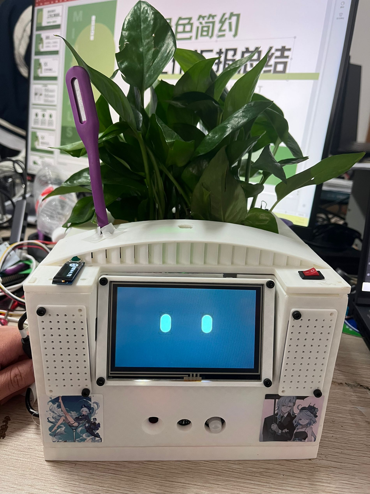

<div align="center">

# FloraMind

## 智能植物养护系统

**Intelligent Plant Care System Based on STM32 + FreeRTOS**

<br>


<br>

[项目简介](#项目简介) ·
[系统架构](#系统架构) ·
[硬件清单](#硬件清单) ·
[软件设计](#软件设计) ·
[快速开始](#快速开始) ·
[English](#english)

</div>

---

## 项目简介

FloraMind 是一个基于 **STM32F103ZET6** 微控制器和 **FreeRTOS** 实时操作系统的智能植物养护系统。系统集成了多传感器环境监测、AI 语音交互、物联网远程控制和拟人化表情反馈四大核心能力，能够自动感知植物生长环境并通过智能算法实现自适应控制。

<div align="center">

</div>

### 核心亮点

| 特性 | 说明 |
|------|------|
| **多传感器融合** | DHT11 温湿度、SGP30 CO2/TVOC、土壤湿度、光照强度、PIR 人体感应、振动检测 |
| **卡尔曼滤波** | 全传感器数据经过卡尔曼滤波处理，CO2 传感器采用动态噪声参数 |
| **自适应阈值** | 温度阈值基于历史数据动态调整，光照/土壤湿度采用动态迟滞控制 |
| **预测性灌溉** | 基于线性外推的土壤湿度趋势预测，防止水泵频繁启停 |
| **拟人表情系统** | 15 种表情状态，基于环境数据的加权评分决策，3 秒防抖平滑过渡 |
| **三端控制** | 本地自动控制 + AI 语音控制 + 阿里云 IoT 远程控制，带优先级仲裁 |
| **FreeRTOS 多任务** | 7 个任务、16 个消息队列、1 个互斥锁，任务间解耦通信 |

---

## 系统架构

```
                         ┌─────────────────┐
                         │   阿里云 IoT    │
                         │   MQTT Broker   │
                         └────────┬────────┘
                                  │ WiFi (AT Commands)
                         ┌────────┴────────┐
                         │    ESP8266      │
                         │ (USART2/115200) │
                         └────────┬────────┘
                                  │
┌──────────────┐       ┌─────────┴─────────┐       ┌──────────────┐
│  TianWen AI  │       │  STM32F103ZET6    │       │  TJC Serial  │
│ Voice Module │◄─────►│  + FreeRTOS       │◄─────►│  LCD Display │
│  (USART3)    │       │  7 Tasks          │       │  (USART1)    │
└──────────────┘       │  16 Queues        │       └──────────────┘
                       └──┬───┬───┬───┬───┘
                          │   │   │   │
              ┌───────────┘   │   │   └───────────┐
              ▼               ▼   ▼               ▼
      ┌──────────────┐ ┌──────────────┐  ┌──────────────┐
      │   Sensors    │ │  Actuators   │  │   Display    │
      ├──────────────┤ ├──────────────┤  ├──────────────┤
      │ DHT11        │ │ Relay x3     │  │ OLED 128x64  │
      │ SGP30        │ │  - Grow Light│  │ (I2C1)       │
      │ ADC x2       │ │  - Water Pump│  └──────────────┘
      │  (Soil+Light)│ │  - Fan       │
      │ PIR (PE0)    │ │ Servo (UART5)│
      │ Vibration    │ └──────────────┘
      └──────────────┘
```

### 数据流

```
Sensors ──► Task 1 (Read + Kalman Filter) ──► Queues ──► Task 2 (State Analysis)
                                                              │
                                                              ▼
                                                     Queues (Auto Control)
                                                              │
ESP8266 UART RX ──► Ring Buffer ──► Task 5 (JSON Parse) ──► Queues (WiFi Control)
                                                              │
TianWen UART RX ──► Task 4 (Command Decode) ──► Queues (Voice Control)
                                                              │
                                                              ▼
                                                     Task 6 (Relay Control)
                                                     ──► Relay GPIO Output
```

---

## 硬件清单

### 主控

| 型号 | 说明 |
|------|------|
| **STM32F103ZET6** | ARM Cortex-M3, 72MHz, 512KB Flash, 64KB SRAM, LQFP144 |

### 传感器模块

| 模块 | 型号 | 接口 | 说明 |
|------|------|------|------|
| 温湿度 | DHT11 | GPIO (PA1) | 单总线协议, ±2°C / ±5%RH |
| 空气质量 | SGP30 | 软件 I2C (PB10/PB11) | CO2 + TVOC 检测 |
| 土壤湿度 | 电容式 | ADC1_CH2 (PA2) | 模拟采样, 0-100% |
| 光照强度 | 光敏电阻 | ADC1_CH3 (PA3) | 模拟采样, 0-100% |
| 人体感应 | HC-SR501 | GPIO (PE0) | PIR 红外检测 |
| 振动检测 | SW-420 | GPIO (PE1) | 数字信号 |

### 通信模块

| 模块 | 型号 | 接口 | 波特率 | 说明 |
|------|------|------|--------|------|
| WiFi | ESP8266 | USART2 (PD5/PD6) | 115200 | AT 指令集, MQTT |
| AI 语音 | 天问 ASRPRO | USART3 (PD8/PD9) | 9600 | 离线语音识别 |

### 显示模块

| 模块 | 型号 | 接口 | 说明 |
|------|------|------|------|
| 串口屏 | TJC4827X543 | USART1 (PA9/PA10) | 4.3寸触摸屏, 480x272, 表情动画 |
| OLED | SSD1306 | I2C1 (PB6/PB7) | 0.96寸, 128x64, 调试信息 |

### 执行机构

| 模块 | 控制引脚 | 说明 |
|------|----------|------|
| 补光灯继电器 | PD0 | 5V LED 补光灯 |
| 水泵继电器 | PD1 | 5V 直流电机微型水泵 |
| 风扇继电器 | PD3 | 5V 轴流风机 |
| 串口舵机 | UART5 (PC12/PD2) | Feetech 总线舵机, 物理姿态交互 |

---

## FreeRTOS 任务架构

| 任务名 | 函数 | 优先级 | 栈大小 | 功能描述 |
|--------|------|--------|--------|----------|
| `cgq_01` | `StartDefaultTask` | High (40) | 4KB | 传感器数据采集 + 卡尔曼滤波 |
| `ztcl_02` | `StartTask02` | High (40) | 4KB | 植物状态分析 + 自动控制决策 + 表情管理 |
| `usart_03` | `StartTask03` | AboveNormal (32) | 4KB | 串口数据发送 (ESP8266 + 天问模块) |
| `twkz_04` | `StartTask04` | AboveNormal (32) | 4KB | 天问语音模块指令处理 |
| `ESP8266_05` | `StartTask05` | High1 (41) | 4KB | WiFi 连接管理 + MQTT JSON 解析 |
| `jdq_06` | `StartTask06` | High (40) | 1KB | 继电器控制 (本地/远程优先级仲裁) |
| `UI_OLED_07` | `StartTask07` | Low (8) | 1KB | OLED 调试信息显示 (默认挂起) |

### 消息队列

| 队列名 | 类型 | 用途 |
|--------|------|------|
| `Kal_wd` | float | 滤波后温度 |
| `Kal_sd` | float | 滤波后湿度 |
| `Kal_trsd` | float | 滤波后土壤湿度 |
| `Kal_gq` | float | 滤波后光照强度 |
| `Kal_co2` | uint16_t | 滤波后 CO2 浓度 |
| `zt_fs/bg/sb` | uint8_t | 本地自动控制决策 (风扇/补光灯/水泵) |
| `tw_fs/bg/sb` | uint8_t | 天问语音控制指令 |
| `ESP8266_fs/bg/sb` | uint8_t | WiFi 远程控制指令 |
| `zw_key` | uint8_t | 植物状态码 |
| `tw_key` | uint8_t | 天问指令码 |

---

## 软件设计

### 卡尔曼滤波

所有传感器数据均经过卡尔曼滤波处理，有效抑制噪声提升数据质量。

**标准滤波模型：**
- 预测: `x̂(k|k-1) = x̂(k-1)`, `P(k|k-1) = P(k-1) + Q`
- 更新: `K = P/(P+R)`, `x̂(k) = x̂(k-1) + K*(z - x̂(k-1))`, `P(k) = (1-K)*P`

**CO2 传感器动态噪声处理：**
- 测量噪声自适应: `R = 2500 + 0.0025 * x²` (误差随浓度平方增长)
- 过程噪声自适应: `Q = 5 + 2 * |Δx/Δt|` (变化越快响应越灵敏)
- 预热保护: CO2 < 480ppm 时跳过滤波直接输出，强制下限 400ppm

### 自适应阈值

温度控制采用基于历史数据的自适应阈值，避免固定阈值在环境变化时的不灵敏或误触发。

- 维护 30 个采样点的环形缓冲区
- 每 3 秒更新一次: `threshold_high = avg + 3°C`, `threshold_low = avg - 3°C`

### 预测性灌溉

基于线性外推的土壤湿度趋势预测，提前采取灌溉措施防止植物受损。

- 预测公式: `X(n+1) = 3X(n) - 3X(n-1) + X(n-2)`
- 预测干燥趋势时自动扩宽迟滞带 (3 → 8)，防止水泵频繁启停

### 多因素风扇控制

采用温度-CO2 复合评分机制：
- 评分公式: `score = 0.6 × (temp/temp_high) + 0.4 × (CO2/CO2_high)`
- 评分超过 1.0 时启动风扇

### 拟人表情决策

系统根据环境数据为植物赋予 15 种拟人化表情，提升用户交互体验。

| 状态 | 权重计算 | 对应表情 |
|------|----------|----------|
| 高温 | 持续时间加权 | 生气 / 眩晕 |
| 干燥 | 持续时间加权 | 哭泣 / 语音提示 |
| CO2 超标 | 持续时间加权 | 眩晕 / 难过 |
| 低温 | 布尔值 | 害怕 |
| 低光 | 布尔值 | 休眠 |
| 正常 | 固定值 1 | 开心 / 害羞 / 互动 |

- 6 种状态加权评分，选择最高权重状态映射表情
- 3 秒防抖机制，确保表情切换平滑
- PIR 检测到人体时触发互动表情 (戳脸、害羞等)

### 优先级仲裁

三端控制 (本地自动 / 语音 / WiFi) 通过优先级仲裁机制协调：
- 远程控制 (语音/WiFi) 优先级高于本地自动控制
- 5 分钟无远程指令后自动回退到本地控制
- 互斥锁保护 ESP8266 UART 防止并发访问

---

## 快速开始

### 环境要求

- **Keil MDK-ARM** v5.38 或更高版本
- **STM32CubeMX** (可选，用于查看/修改 .ioc 配置)
- **ST-Link V2** 调试器

### 编译步骤

```bash
# 1. 克隆仓库
git clone https://github.com/liaojingwu20041031/FloraMind.git

# 2. 用 Keil 打开项目
#    打开 MDK-ARM/duoji____xm.uvprojx

# 3. 编译 (F7)

# 4. 连接 ST-Link, 下载到芯片 (F8)
```

### WiFi 配置

修改 `Core/wc/wifi.h` 中的热点名称和密码：

```c
#define wifi_num "your_wifi_ssid"      // WiFi 名称
#define wifi_key "your_wifi_password"  // WiFi 密码
```

### 阿里云 IoT 配置

修改 `Core/wc/wifi.c` 中的 MQTT 连接参数：

```c
#define productKey   "your_product_key"
#define deviceName   "your_device_name"
#define deviceSecret "your_device_secret"
```

---

## 引脚映射

| 功能 | 引脚 | 端口 | 外设 | 波特率 |
|------|------|------|------|--------|
| DHT11 温湿度 | PA1 | GPIOA | GPIO Input | - |
| 土壤湿度 ADC | PA2 | GPIOA | ADC1_CH2 | - |
| 光照传感器 ADC | PA3 | GPIOA | ADC1_CH3 | - |
| SGP30 SCL | PB10 | GPIOB | Software I2C | - |
| SGP30 SDA | PB11 | GPIOB | Software I2C | - |
| TJC 串口屏 TX | PA9 | GPIOA | USART1 | 9600 |
| TJC 串口屏 RX | PA10 | GPIOA | USART1 | 9600 |
| ESP8266 TX | PD5 | GPIOD | USART2 (Remap) | 115200 |
| ESP8266 RX | PD6 | GPIOD | USART2 (Remap) | 115200 |
| 天问语音 TX | PD8 | GPIOD | USART3 (Remap) | 9600 |
| 天问语音 RX | PD9 | GPIOD | USART3 (Remap) | 9600 |
| 舵机 TX | PC12 | GPIOC | UART5 | 9600 |
| 舵机 RX | PD2 | GPIOD | UART5 | 9600 |
| 补光灯继电器 | PD0 | GPIOD | GPIO Output | - |
| 水泵继电器 | PD1 | GPIOD | GPIO Output | - |
| 风扇继电器 | PD3 | GPIOD | GPIO Output | - |
| PIR 人体感应 | PE0 | GPIOE | GPIO Input | - |
| 振动传感器 | PE1 | GPIOE | GPIO Input | - |

> 详细引脚说明见 [docs/pin_mapping.md](docs/pin_mapping.md)

---

## 项目结构

```
FloraMind/
├── Core/
│   ├── Inc/                    # 头文件 (HAL 自动生成)
│   │   ├── main.h              # 引脚定义
│   │   ├── FreeRTOSConfig.h    # FreeRTOS 配置
│   │   └── ...
│   ├── Src/                    # 源文件 (HAL 自动生成)
│   │   ├── main.c              # 主入口, 外设初始化
│   │   ├── freertos.c          # 核心应用逻辑 (7 个任务)
│   │   ├── adc.c, dma.c, gpio.c, i2c.c, rtc.c, tim.c, usart.c
│   │   └── stm32f1xx_it.c      # 中断处理
│   └── wc/                     # 自定义模块
│       ├── wifi.c/h            # ESP8266 WiFi 驱动
│       ├── jdq.c/h             # 继电器控制 + 优先级仲裁
│       ├── DHT11.c/h           # DHT11 温湿度传感器
│       ├── sgp30.c/h           # SGP30 CO2/TVOC 传感器
│       ├── adc_2.c/h           # ADC 数据处理
│       ├── Kal_lb.c/h          # 卡尔曼滤波器
│       ├── tjc_usart_hmi.c/h   # TJC 串口屏驱动
│       ├── servo.c/h           # Feetech 舵机驱动
│       └── cJSON.c/h           # JSON 解析库
├── Drivers/
│   ├── CMSIS/                  # ARM CMSIS
│   └── STM32F1xx_HAL_Driver/   # STM32 HAL 库
├── Middlewares/
│   └── Third_Party/FreeRTOS/   # FreeRTOS v10.0.1
├── MDK-ARM/
│   └── duoji____xm.uvprojx     # Keil 项目文件
├── docs/
│   ├── pin_mapping.md          # 引脚映射详解
│   ├── communication_protocols.md  # 通信协议详解
│   └── algorithm_design.md     # 算法设计详解
├── duoji____xm.ioc             # STM32CubeMX 配置
├── README.md
├── LICENSE
└── .gitignore
```

---

## 通信协议

| 模块 | 协议 | 说明 |
|------|------|------|
| ESP8266 | MQTT over AT | 阿里云 IoT, JSON 数据上报 + 远程控制 |
| 天问语音 | 自定义 UART 帧 | `FF {cmd} 00` 下行, `{标识+数据}` 上行 |
| TJC 串口屏 | HMI 指令 | `{attr} {value} FF FF FF` |
| Feetech 舵机 | 总线协议 | `55 {len} {cmd} {params...}` |

> 详细协议说明见 [docs/communication_protocols.md](docs/communication_protocols.md)

---

## 算法设计

本项目实现了多种智能控制算法，详见 [docs/algorithm_design.md](docs/algorithm_design.md)：

- **卡尔曼滤波** -- 单变量卡尔曼滤波器，CO2 传感器动态噪声自适应
- **动态迟滞控制** -- 根据变化速率动态调整迟滞宽度，避免频繁切换
- **自适应阈值** -- 环形缓冲区存储历史数据，动态计算高低阈值
- **预测性灌溉** -- 线性外推预测土壤湿度趋势
- **表情决策系统** -- 6 状态加权评分 + 持续时间衰减

---

## English

### Overview

**FloraMind** is an intelligent plant care system built on the STM32F103ZET6 microcontroller running FreeRTOS v10.0.1. It integrates multi-sensor environmental monitoring, AI voice interaction, IoT remote control, and anthropomorphic expression feedback to automatically sense plant growing conditions and implement adaptive control through intelligent algorithms.

### Key Features

- **Multi-Sensor Fusion** -- DHT11 (temp/humidity), SGP30 (CO2/TVOC), soil moisture, light intensity, PIR motion, and vibration sensors
- **Kalman Filtering** -- All sensor data processed through Kalman filters with dynamic noise adaptation for CO2
- **Adaptive Thresholds** -- Temperature thresholds dynamically adjusted based on historical data; light/soil use dynamic hysteresis
- **Predictive Irrigation** -- Linear extrapolation of soil moisture trends prevents pump cycling
- **Expression System** -- 15 anthropomorphic expressions based on weighted environmental state evaluation
- **Triple Control** -- Local auto-control + AI voice + Alibaba Cloud IoT remote control with priority arbitration
- **FreeRTOS Architecture** -- 7 tasks, 16 message queues, 1 mutex for decoupled inter-task communication

### Hardware

- **MCU**: STM32F103ZET6 (72MHz Cortex-M3, 512KB Flash, 64KB RAM)
- **Sensors**: DHT11, SGP30, analog soil moisture & light, PIR, vibration
- **Communication**: ESP8266 WiFi (MQTT), TianWen AI voice module
- **Display**: TJC 4.3" serial touchscreen, 0.96" OLED
- **Actuators**: 3-channel relay (grow light, water pump, fan), Feetech serial servos

### Quick Start

1. Clone the repository
2. Open `MDK-ARM/duoji____xm.uvprojx` in Keil MDK-ARM
3. Configure WiFi credentials in `Core/wc/wifi.h`
4. Build (F7) and flash with ST-Link (F8)

---

## License

This project is licensed under the MIT License - see the [LICENSE](LICENSE) file for details.

---

<div align="center">

**FloraMind** -- 让每一株植物都被温柔以待 🌱

</div>
