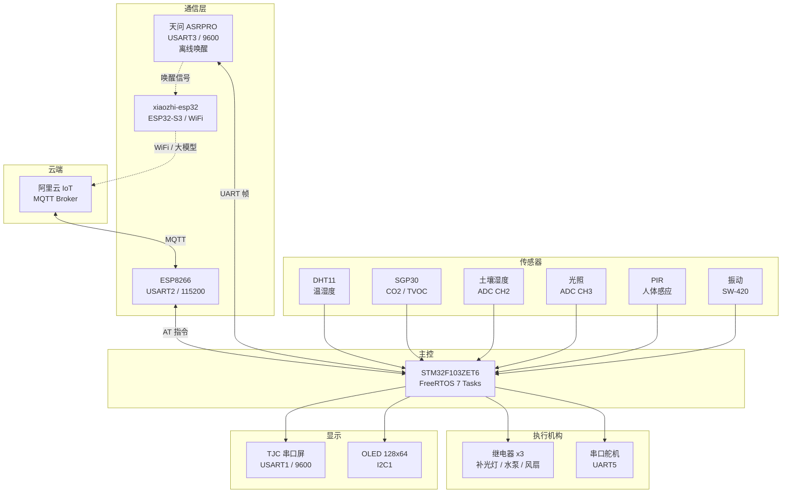
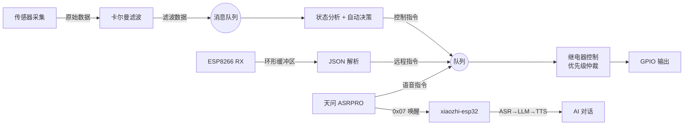
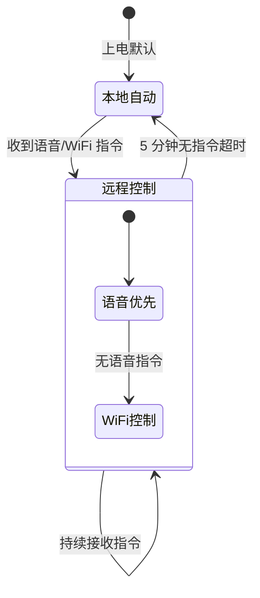

<div align="center">

# FloraMind

### 智能植物养护系统

**Intelligent Plant Care System Based on STM32 + FreeRTOS**

<br>


<br>

[系统架构](#系统架构) ·
[硬件平台](#硬件平台) ·
[软件设计](#软件设计) ·
[快速开始](#快速开始) ·
[English](#english)

</div>

---

## 项目简介

FloraMind 是基于 **STM32F103ZET6 + FreeRTOS** 的智能植物养护系统，集成六大核心能力：

| 能力 | 实现 |
|:-----|:-----|
| **多传感器融合** | DHT11 温湿度 / SGP30 CO2+TVOC / 土壤湿度 / 光照 / PIR / 振动 |
| **智能算法** | 卡尔曼滤波 (CO2 动态噪声) · 自适应阈值 · 预测性灌溉 |
| **AI 语音交互** | [xiaozhi-esp32](https://github.com/78/xiaozhi-esp32) 在线大模型对话 + [天问 ASRPRO](http://www.ai-asr.com/) 离线唤醒 |
| **物联网远程控制** | ESP8266 → 阿里云 IoT (MQTT)，JSON 数据上报 + 远程指令 |
| **拟人表情系统** | 15 种表情，6 状态加权评分，3 秒防抖平滑过渡 |
| **实时多任务** | FreeRTOS 7 任务 / 16 消息队列 / 优先级仲裁 |

<div align="center">

</div>

---

## 系统架构

### 硬件拓扑



### 数据流



---

## 硬件平台

### 主控

| 型号 | 架构 | 主频 | Flash | SRAM | 封装 |
|:-----|:-----|:-----|:------|:-----|:-----|
| **STM32F103ZET6** | ARM Cortex-M3 | 72 MHz | 512 KB | 64 KB | LQFP144 |

### 传感器

| 模块 | 型号 | 接口 | 参数 |
|:-----|:-----|:-----|:-----|
| 温湿度 | DHT11 | PA1 (单总线) | ±2°C / ±5%RH |
| 空气质量 | SGP30 | PB10/PB11 (I2C) | CO2 400-60000ppm + TVOC |
| 土壤湿度 | 电容式 | PA2 (ADC1_CH2) | 0-100% |
| 光照强度 | 光敏电阻 | PA3 (ADC1_CH3) | 0-100% |
| 人体感应 | HC-SR501 | PE0 (GPIO) | PIR 红外 |
| 振动检测 | SW-420 | PE1 (GPIO) | 数字信号 |

### 通信

| 模块 | 型号 | 接口 | 说明 |
|:-----|:-----|:-----|:-----|
| WiFi | ESP8266 | USART2 (PD5/PD6) 115200 | AT 指令 → MQTT → 阿里云 |
| AI 语音 (在线) | [xiaozhi-esp32](https://github.com/78/xiaozhi-esp32) | WiFi STA | 大模型对话 + TTS 语音合成 |
| 语音唤醒 (离线) | 天问 ASRPRO | USART3 (PD8/PD9) 9600 | 唤醒词检测 + 本地指令 → 联动 xiaozhi |

### 显示 & 执行

| 模块 | 接口 | 说明 |
|:-----|:-----|:-----|
| TJC4827X543 串口屏 | USART1 (PA9/PA10) 9600 | 4.3 寸触摸屏，表情动画 |
| SSD1306 OLED | I2C1 (PB6/PB7) | 0.96 寸，调试信息 |
| 继电器 x3 | PD0 / PD1 / PD3 | 补光灯 / 水泵 / 风扇 |
| Feetech 舵机 | UART5 (PC12/PD2) 9600 | 物理姿态交互 |

---

## 软件设计

### FreeRTOS 任务架构

| 任务 | 优先级 | 栈 | 功能 |
|:-----|:------:|:--:|:-----|
| `cgq_01` 传感器采集 | High (40) | 4K | 读取 6 路传感器 + 卡尔曼滤波 |
| `ztcl_02` 状态分析 | High (40) | 4K | 环境状态评估 + 自动控制决策 + 表情管理 |
| `usart_03` 串口发送 | AboveNormal (32) | 4K | ESP8266 + 天问模块数据上报 |
| `twkz_04` 语音指令 | AboveNormal (32) | 4K | 天问 ASRPRO 指令解码与执行 |
| `ESP8266_05` WiFi | Highest (41) | 4K | WiFi 连接管理 + MQTT JSON 解析 |
| `jdq_06` 继电器控制 | High (40) | 1K | 本地/远程优先级仲裁 |
| `UI_OLED_07` 显示 | Low (8) | 1K | OLED 调试 (默认挂起) |

### 核心算法

#### 卡尔曼滤波

所有传感器数据经过卡尔曼滤波处理。CO2 传感器采用动态噪声自适应：

- **测量噪声**: `R = 2500 + 0.0025 × x²` — 误差随浓度平方增长
- **过程噪声**: `Q = 5 + 2 × |Δx/Δt|` — 变化越快响应越灵敏
- 预热保护：CO2 < 480ppm 时跳过滤波，强制下限 400ppm

#### 预测性灌溉

基于 3 采样点线性外推预测土壤湿度趋势：

```
X(n+1) = 3X(n) - 3X(n-1) + X(n-2)
```

预测干燥趋势时自动扩宽迟滞带 (3 → 8)，防止水泵频繁启停。

#### 优先级仲裁



---

## 快速开始

### 环境

| 工具 | 版本 |
|:-----|:-----|
| Keil MDK-ARM | v5.38+ |
| STM32CubeMX | 可选，查看 .ioc 配置 |
| ST-Link V2 | 调试下载 |

### 编译 & 烧录

```bash
git clone https://github.com/liaojingwu20041031/FloraMind.git
# 用 Keil 打开 MDK-ARM/duoji____xm.uvprojx
# F7 编译 → F8 烧录
```

### 配置

**WiFi** — 修改 `Core/wc/wifi.h`：

```c
#define wifi_num "your_ssid"
#define wifi_key "your_password"
```

**阿里云 IoT** — 修改 `Core/wc/wifi.c`：

```c
#define productKey   "your_product_key"
#define deviceName   "your_device_name"
#define deviceSecret "your_device_secret"
```

---

## 引脚映射

<details>
<summary>点击展开完整引脚表</summary>

| 功能 | 引脚 | 外设 | 波特率 |
|:-----|:-----|:-----|:------:|
| DHT11 温湿度 | PA1 | GPIO Input | - |
| 土壤湿度 ADC | PA2 | ADC1_CH2 | - |
| 光照传感器 ADC | PA3 | ADC1_CH3 | - |
| SGP30 SCL | PB10 | Software I2C | - |
| SGP30 SDA | PB11 | Software I2C | - |
| TJC 串口屏 TX | PA9 | USART1 | 9600 |
| TJC 串口屏 RX | PA10 | USART1 | 9600 |
| ESP8266 TX | PD5 | USART2 (Remap) | 115200 |
| ESP8266 RX | PD6 | USART2 (Remap) | 115200 |
| 天问语音 TX | PD8 | USART3 (Remap) | 9600 |
| 天问语音 RX | PD9 | USART3 (Remap) | 9600 |
| 舵机 TX | PC12 | UART5 | 9600 |
| 舵机 RX | PD2 | UART5 | 9600 |
| 补光灯继电器 | PD0 | GPIO Output | - |
| 水泵继电器 | PD1 | GPIO Output | - |
| 风扇继电器 | PD3 | GPIO Output | - |
| PIR 人体感应 | PE0 | GPIO Input | - |
| 振动传感器 | PE1 | GPIO Input | - |

> 详见 [docs/pin_mapping.md](docs/pin_mapping.md)

</details>

---

## 项目结构

```
FloraMind/
├── Core/
│   ├── Inc/                    # CubeMX 生成头文件
│   ├── Src/                    # CubeMX 生成源文件
│   │   └── freertos.c          # 核心逻辑：7 个 FreeRTOS 任务
│   └── wc/                     # 自定义驱动模块
│       ├── wifi.c/h            #   ESP8266 WiFi + MQTT
│       ├── jdq.c/h             #   继电器 + 优先级仲裁
│       ├── DHT11.c/h           #   温湿度传感器
│       ├── sgp30.c/h           #   CO2/TVOC 传感器
│       ├── Kal_lb.c/h          #   卡尔曼滤波器
│       ├── tjc_usart_hmi.c/h   #   TJC 串口屏
│       ├── servo.c/h           #   Feetech 舵机
│       └── cJSON.c/h           #   JSON 解析
├── Drivers/                    # STM32 HAL + CMSIS
├── Middlewares/Third_Party/    # FreeRTOS v10.0.1
├── MDK-ARM/                    # Keil 工程文件
├── docs/                       # 详细文档
│   ├── pin_mapping.md
│   ├── communication_protocols.md
│   └── algorithm_design.md
└── duoji____xm.ioc             # CubeMX 配置
```

> AI 语音部分基于 [xiaozhi-esp32](https://github.com/78/xiaozhi-esp32)，代码独立维护。

---

## 通信协议

| 模块 | 协议 | 说明 |
|:-----|:-----|:-----|
| ESP8266 | MQTT over AT | 阿里云 IoT，JSON 上报 + 远程控制 |
| xiaozhi-esp32 | WiFi STA | 大模型对话 + TTS 语音合成 |
| 天问 ASRPRO | UART 帧 | 离线唤醒 + `FF {cmd} 00` 本地指令 |
| TJC 串口屏 | HMI 指令 | `{attr} {value} FF FF FF` |
| Feetech 舵机 | 总线协议 | `55 {len} {cmd} {params...}` |

> 详见 [docs/communication_protocols.md](docs/communication_protocols.md)

---

## English

**FloraMind** is an intelligent plant care system built on STM32F103ZET6 + FreeRTOS v10.0.1. It features multi-sensor environmental monitoring, AI voice interaction ([xiaozhi-esp32](https://github.com/78/xiaozhi-esp32) for online LLM conversation + [TianWen ASRPRO](http://www.ai-asr.com/) for offline wake-up), IoT remote control via Alibaba Cloud MQTT, and a 15-expression anthropomorphic feedback system.

**Key Features:** Kalman filtering with dynamic noise adaptation · Predictive irrigation via linear extrapolation · Adaptive threshold control · Priority arbitration (remote > local, 5-min timeout) · 7-task FreeRTOS architecture with 16 message queues

**Quick Start:** Clone → Open `MDK-ARM/duoji____xm.uvprojx` in Keil → Configure WiFi in `Core/wc/wifi.h` → Build (F7) → Flash with ST-Link (F8)

---

<div align="center">

**FloraMind** — 让每一株植物都被温柔以待

[MIT License](LICENSE) · [贡献指南](CONTRIBUTING.md)

</div>
